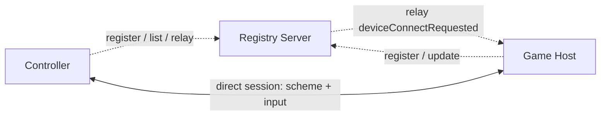

# Architecture

This page is the map of the protocol: who talks to whom, and how the pieces stack up. The [Overview](index.md) covers the concrete primitives (device identity, transport ports, the packet fields), and the rest of the specification documents each piece in detail. Here we just frame how they fit together.

## Participants

Three kinds of device take part, told apart by their `deviceType` (see [Roles](index.md#roles)):

- A **game host** runs the game and the BM SDK.
- A **controller** is the phone app standing in for a gamepad.
- A **registry server** sits between them as a matchmaker.

They communicate in two stages. First the host and controller find each other through the server. Then they talk to each other directly, and the server steps out of the way.

## Two Phases

**Rendezvous** happens over each device's single TCP connection to the registry server. Hosts announce themselves with `registry.register`, controllers discover them with `registry.list` and the `onHostConnected` push, and a controller asks to join a specific host by sending a `deviceConnectRequested` through `registry.relay`. This whole phase is [Registry RPC](registry/index.md).

**The direct session** begins once the host acknowledges that request and opens a direct connection to the controller. From there the host delivers the control scheme and the two exchange input for the rest of play. This phase is [Game Session RPC](session/index.md), and the registry server is not involved in it at all.

The relay is the hinge between the two: it is how a controller reaches a host it has no direct line to yet, just long enough to arrange one.

## Protocol Layers

Every byte on the wire is built up through the same layers, whichever phase is active. Each layer has its own page in this specification.

| Layer | Responsibility | Reference |
|-------|----------------|-----------|
| Transport | Move bytes over TCP (reliable) or UDP (unreliable). Each device listens on one port for each. | [TCP Framing](transport/tcp-framing.md), [UDP Framing](transport/udp-framing.md) |
| Framing | Mark message boundaries: a 4-byte length prefix on TCP, the datagram itself on UDP. | [TCP Framing](transport/tcp-framing.md) |
| Serialization | Encode values little-endian: an object envelope plus class id, and length-prefixed UTF-8 strings. | [Object Encoding](serialization/object-encoding.md), [Class ID Registry](serialization/class-ids.md), [Primitive Types](serialization/primitives.md) |
| Packet | Wrap each message in a `BMPacket` carrying its channel, sequence, type, and the sender's identity. | [BMPacket](packets/bm-packet.md), [Packet Types](packets/packet-types.md), [Channels](packets/channels.md) |
| Message | The payload itself, in one of two shapes: a `BMInvoke` RPC call, or a typed input object. | [BMInvoke](objects/bm-invoke.md), [Input Messages](messages/index.md) |
| Application | The actual conversation: registry RPC during rendezvous, session RPC and input during play. | [Registry RPC](registry/index.md), [Game Session RPC](session/index.md) |

## One Connection, Many Channels

A single connection is not single-purpose. Each `BMPacket` names a **channel**, which both routes the payload (what kind of message to expect) and selects a default transport (reliable or unreliable). RPC rides the reliable Message channel, control-scheme bytes ride the reliable Bytes channel, and the high-frequency input streams ride their own channels that default to unreliable. Every channel keeps its own sequence counter, so a gap in one stream says nothing about the others. See [Channels](packets/channels.md) and [Reliability Modes](../reference/reliability-modes.md).
