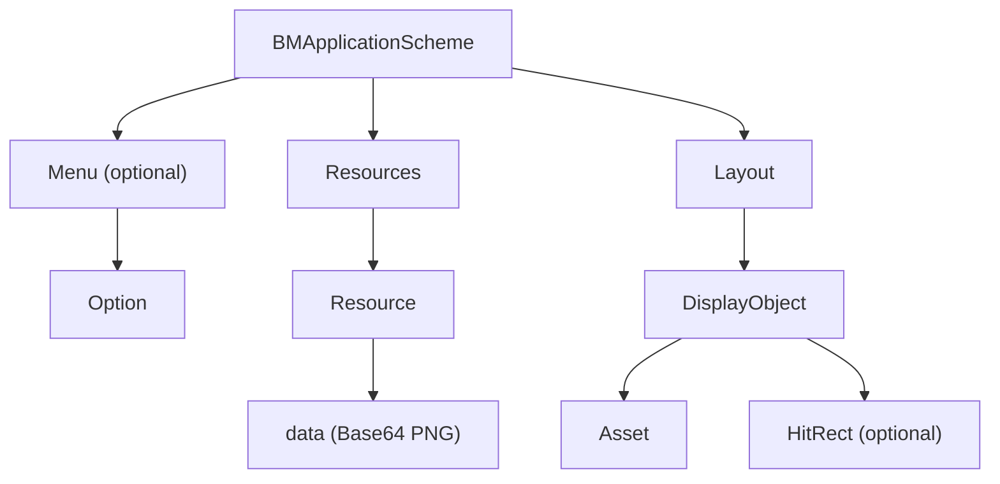

# Control Scheme XML

A control scheme is the on-screen layout a game hands to the controller: the buttons, d-pad, images, and text that make up the gamepad, along with the artwork to draw them with. The game delivers it as a single XML document (see [RequestXML & Delivery](../session/request-xml.md)), the controller parses it, and from then on the controller renders that layout and reports the matching input back.

## Document Structure

The document is a `<BMApplicationScheme>` root that carries the scheme-wide settings as attributes and holds three kinds of child content: an optional context [`<Menu>`](context-menu.md), a [`<Resources>`](resources.md) block of artwork, and a `<Layout>` block of [display objects](display-objects.md).



A concrete document then looks like this:

```xml
<?xml version="1.0" encoding="utf-8"?>
<BMApplicationScheme version="0.1" orientation="landscape" touchEnabled="yes" width="480" height="320" sample="linear" accelerometerEnabled="yes">
  <Resources>
    <Resource id="1" type="image">
      <data><![CDATA[iVBORw0KGgoAAAANSUhEUg...]]></data>
    </Resource>
  </Resources>
  <Layout>
    <DisplayObject id="2" type="button" hidden="no" top="0.1" left="0.1" width="0.2" height="0.3" functionHandler="fire">
      <Asset name="up" resourceRef="1" />
      <Asset name="down" resourceRef="1" />
    </DisplayObject>
  </Layout>
</BMApplicationScheme>
```

## Root Attributes

| Attribute | Type | Description |
|-----------|------|-------------|
| `version` | string | Scheme format version. Always `0.1` in practice. |
| `orientation` | string | `landscape` or `portrait`. The orientation the controller should present. |
| `width` | int | Design width of the layout, in scheme units. Typically `480` (landscape) or `320` (portrait). |
| `height` | int | Design height of the layout, in scheme units. Typically `320` (landscape) or `480` (portrait). |
| `touchEnabled` | yes/no | Whether the scheme accepts raw [touch](../messages/touch.md) input. |
| `accelerometerEnabled` | yes/no | Whether the scheme uses the [accelerometer](../messages/acceleration.md). |
| `sample` | string | Default image sampling for the whole scheme, `linear` or `nearest`. Individual objects can override it (see [Display Objects](display-objects.md)). |

Every `yes/no` attribute follows the same rule: any value other than the exact string `no` counts as yes.

Not every writer emits every attribute. `width`, `height` and `sample` are all
absent from some documents, so a parser needs defaults rather than a required
set. `sample` defaults to `linear`.

## Coordinate System

Positions and sizes are not pixels. Every `left`, `top`, `width`, and `height` (on both display objects and their hit rects) is a normalized fraction in the range `0` to `1`, measured against the scheme's `width` and `height`. A button at `left="0.5"` sits halfway across the layout regardless of the device's real resolution. The controller scales those fractions to its own screen, which is what lets one scheme fit any phone.

## Parsing

Controllers parse the document by element name as it streams in, rather than by strict nesting. The meaningful elements are the leaves: `BMApplicationScheme`, `Resource`, `DisplayObject`, `Asset`, `HitRect`, `Option`, and the `data` block inside a resource. The `<Resources>`, `<Layout>`, and `<Menu>` wrappers are just containers and carry no attributes of their own, so a parser can treat them as grouping and act only on the leaves it recognizes, ignoring anything it does not.

Some documents begin with a UTF-8 byte order mark, so a parser has to skip one before the declaration.

## Updates

A game can send a scheme again mid-session to change the layout, for example when a menu opens. An update is another scheme document, delivered the same way but under the `updateXML` set id, and it is merged into the current scheme rather than replacing it.

| Part | On an update |
|------|--------------|
| Root attributes | Ignored. The base keeps the ones it was given. |
| Resources | Overlaid by `id`. A matching id is replaced, a new one is appended, and one the update omits is kept. |
| Display objects | Replaced wholesale. Anything the update omits is gone. |
| Menu options | Replaced. An update carrying no options clears the menu. |

The asymmetry between resources and display objects is the point of the format. Layout is text and cheap to resend in full, while artwork is Base64 encoded image data and expensive, so an update carries the whole of the new layout but only the artwork that changed. An update is typically a small fraction of the document that established the scheme.

## See Also

- [Display Objects](display-objects.md) for the `<DisplayObject>` element and its types.
- [Resources & Assets](resources.md) for how artwork is embedded and referenced.
- [Context Menu](context-menu.md) for the `<Menu>` and its options.
- [RequestXML & Delivery](../session/request-xml.md) for how the document reaches the controller.
