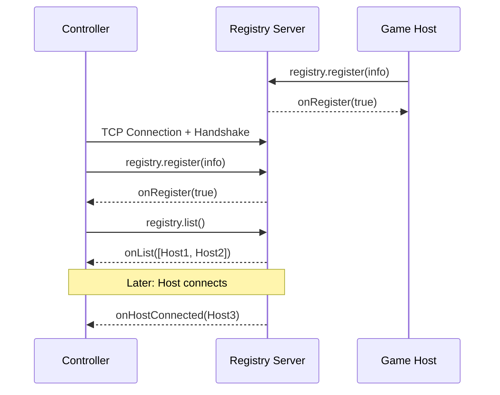

# Registry RPC

The registry server acts as a matchmaker between game hosts and controllers. All registry communication uses [`BMInvoke`](../objects/bm-invoke.md) RPC calls sent on channel 3 (Message).

!!! note
    Method names are fixed and every endpoint must recognise them. Return method names are not, and never have been: a caller names a method on its own handler, so `registry.register` draws a reply to `onRegister` from one implementation and `onRegisterSuccess` from another. A registry replies with whatever name it was given rather than one it prefers.

    This applies only to **replies**. `onHostConnected` and the other pushes are calls the server initiates, so those names are fixed like any other method. See [Return Values](../objects/bm-invoke.md#return-values).

## Connection Flow

1. Controller connects to the registry server over TCP.
2. Both sides exchange the [handshake](../connection/handshake.md).
3. The controller calls `registry.register` to identify itself.
4. On success, meaning the reply it asked for comes back `true`, the controller calls `registry.list` to retrieve available game hosts.
5. The server sends push notifications (`onHostConnected`, `onHostDisconnected`, `onHostUpdate`) as hosts come and go.

## RPC Methods

### Client to Server

| Method | Return Method | Arguments | Description |
|--------|---------------|-----------|-------------|
| [`registry.register`](register.md) | caller's own | `BMRegistryInfo` [, `domain`] | Register this device with the server. |
| [`registry.list`](list.md) | caller's own | (none) | Request the current list of available game hosts. |
| [`registry.relay`](relay.md) | (none) | `BMRegistryInfo`, `BMInvoke` | Relay an RPC call to a specific device via the server. |
| [`registry.update`](update.md) | caller's own | `BMRegistryInfo` | Replace the info held for this device, usually to change `currentPlayers`. |
| `registry.remove` | caller's own | `deviceId` (string) | Unregister this device. |
| `registry.setVisible` | (none) | `visible` (bool), `notifyEveryone` (bool) | Show or hide this host in the list others receive. |

`registry.remove` takes the caller's own `deviceId` as a plain string rather than a `BMRegistryInfo`, which makes it the only registry call that does not carry the whole object.

### Replies

Sent back to whoever made the call above, under the name that call asked for.
The names here are what implementations have been seen to ask for, not names a
server may choose.

| Typical name | Returns | Description |
|--------------|---------|-------------|
| `onRegister`, `onRegisterSuccess` | `boolean` | Registration result. `true` if successful. |
| `onList` | `BMArray` | Array of `BMRegistryInfo` objects representing available game hosts. |

### Server to Client (Push)

These are calls the server makes on its own, not replies, so their names are
fixed like any other method and an endpoint has to recognise them.

| Method | Arguments | Description |
|--------|-----------|-------------|
| `onHostConnected` | `BMRegistryInfo` | A new game host has registered. |
| `onHostDisconnected` | `BMRegistryInfo` | A game host has disconnected from the registry. |
| `onHostUpdate` | `BMRegistryInfo` | A game host's metadata has changed (e.g., player count). |

## Notes

- All registry RPC traffic is sent as `BMPacket` with packet type Data (0) on channel 3 (Message).
- The `registry.register` call optionally includes a `domain` string to scope discovery to a specific app domain.
- After a successful registration, the controller immediately requests the host list via `registry.list`.
- The `registry.relay` method is used for indirect communication between devices that haven't established a direct connection yet (e.g., sending `deviceConnectRequested` to a game host).