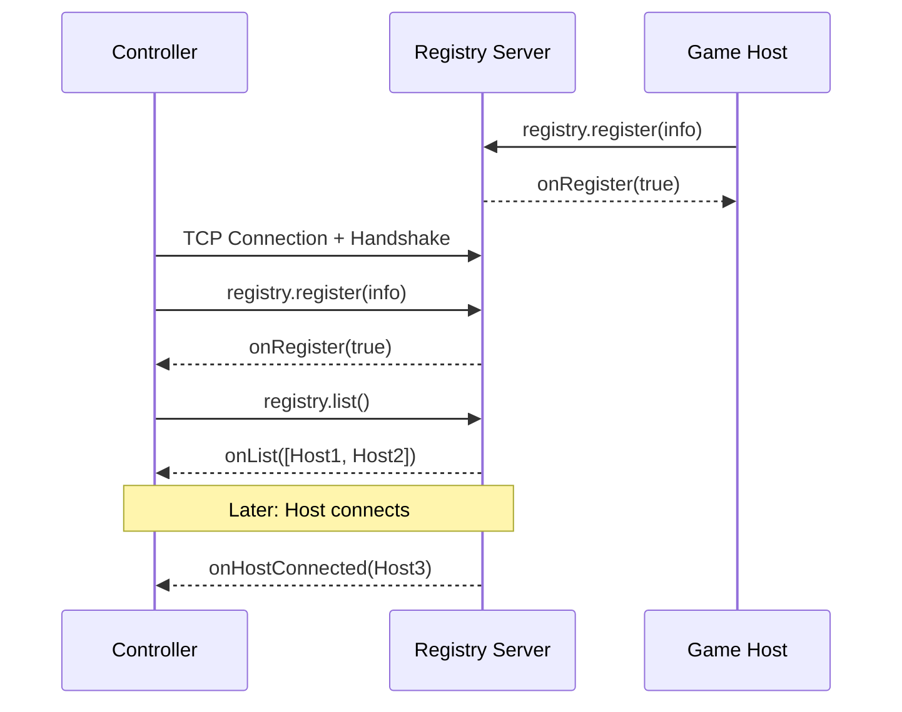

# Registry RPC

The registry server acts as a matchmaker between game hosts and controllers. All registry communication uses [`BMInvoke`](../objects/bm-invoke.md) RPC calls sent on channel 3 (Message).

## Connection Flow

1. Controller connects to the registry server over TCP.
2. Both sides exchange the [handshake](../connection/handshake.md).
3. The controller calls `registry.register` to identify itself.
4. On success (`onRegister` returns `true`), the controller calls `registry.list` to retrieve available game hosts.
5. The server sends push notifications (`onHostConnected`, `onHostDisconnected`, `onHostUpdate`) as hosts come and go.

## RPC Methods

### Client to Server

| Method | Return Method | Arguments | Description |
|--------|---------------|-----------|-------------|
| `registry.register` | `onRegister` | `BMRegistryInfo` [, `domain`] | Register this device with the server. |
| `registry.list` | `onList` | (none) | Request the current list of available game hosts. |
| `registry.relay` | (none) | `BMRegistryInfo`, `BMInvoke` | Relay an RPC call to a specific device via the server. |

### Server to Client (Push)

| Method | Arguments | Description |
|--------|-----------|-------------|
| `onRegister` | `boolean` | Registration result. `true` if successful. |
| `onList` | `BMArray` | Array of `BMRegistryInfo` objects representing available game hosts. |
| `onHostConnected` | `BMRegistryInfo` | A new game host has registered. |
| `onHostDisconnected` | `BMRegistryInfo` | A game host has disconnected from the registry. |
| `onHostUpdate` | `BMRegistryInfo` | A game host's metadata has changed (e.g., player count). |

## Notes

- All registry RPC traffic is sent as `BMPacket` with packet type Data (0) on channel 3 (Message).
- The `registry.register` call optionally includes a `domain` string to scope discovery to a specific app domain.
- After a successful registration, the controller immediately requests the host list via `registry.list`.
- The `registry.relay` method is used for indirect communication between devices that haven't established a direct connection yet (e.g., sending `deviceConnectRequested` to a game host).