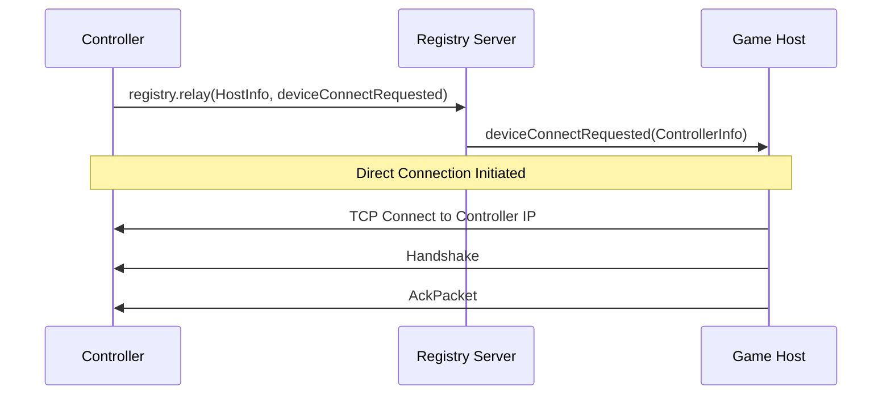

# registry.relay

Relays an RPC call to a specific device through the registry server. This is used when two devices have not yet established a direct connection.

## Request

| Field | Value |
|-------|-------|
| **Method** | `registry.relay` |
| **Return Method** | (empty string) |
| **Arguments** | 2 |

### Arguments

| # | Type | Description |
|---|------|-------------|
| 1 | `BMRegistryInfo` | The target device to relay the message to. |
| 2 | `BMInvoke` | The RPC call to forward to the target device. |

The return method is an empty string because relay messages are fire-and-forget from the sender's perspective. The response, if any, comes from the target device via a separate relay or direct connection.

## Primary Use Case: deviceConnectRequested

The main use of `registry.relay` is to initiate a direct connection between a controller and a game host:

1. The controller selects a game host from the list received via [`onList`](list.md).
2. The controller calls `registry.relay` with:
    - **Target**: The selected host's `BMRegistryInfo`.
    - **Payload**: A `BMInvoke` calling `deviceConnectRequested` with the controller's own `BMRegistryInfo` as the argument.
3. The registry server forwards this `BMInvoke` to the game host.
4. The game host receives the `deviceConnectRequested` call, opens a direct TCP connection to the controller using the address from the relayed `BMRegistryInfo`, and sends an [AckPacket](../messages/ping-ack.md#ackpacket) over the new direct connection.

## Notes

- The relay payload is a nested `BMInvoke` inside the outer `registry.relay` invoke. See [BMInvoke](../objects/bm-invoke.md) for the wire format.
- The registry server does not interpret the relayed `BMInvoke`; it simply forwards it to the target device.