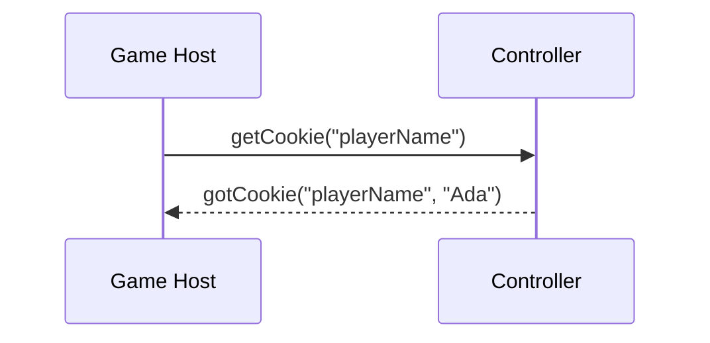

# Cookies (getCookie / setCookie)

Cookies are small pieces of data a game can stash on the controller and read back later. Because they live on the phone rather than in the game, they stick around between sessions, which makes them handy for remembering things like a player's name, a saved option, or a bit of progress. The feature is made of three wire methods, and all of them travel as [`BMInvoke`](../objects/bm-invoke.md) calls on the Message channel.

## setCookie

This is how the host saves a value on the controller. It's a one-way call: the controller stores the value, and nothing comes back.

| Field | Value |
|-------|-------|
| **Method** | `setCookie` |
| **Arguments** | 2 |

### Arguments

| # | Type | Description |
|---|------|-------------|
| 1 | `string` | The cookie's name (its key). |
| 2 | `string` | The value to store under that name. |

## getCookie

This is how the host asks for a value it saved earlier. The answer doesn't come back through the usual return-method mechanism; instead the controller sends a separate `gotCookie` call (below). That's why `getCookie` itself carries no return method.

| Field | Value |
|-------|-------|
| **Method** | `getCookie` |
| **Arguments** | 1 |

### Arguments

| # | Type | Description |
|---|------|-------------|
| 1 | `string` | The name of the cookie to look up. |

## gotCookie

The controller's answer to `getCookie`. It travels back to the host as its own named call rather than as a return value.

| Field | Value |
|-------|-------|
| **Method** | `gotCookie` |
| **Arguments** | 2 |

### Arguments

| # | Type | Description |
|---|------|-------------|
| 1 | `string` | The name that was asked for. |
| 2 | `string` | The stored value, or an empty string if nothing was ever saved under that name. |

## Reading a cookie

## Behavior

A cookie belongs to the controller, not to a single game session, so whatever `setCookie` writes stays put and a later `getCookie` for the same name reads it back. Asking for a name that was never written isn't an error; the controller just answers with an empty value. And since `setCookie` never replies, a host that wants to be sure a write actually landed can always follow it with a `getCookie`.
