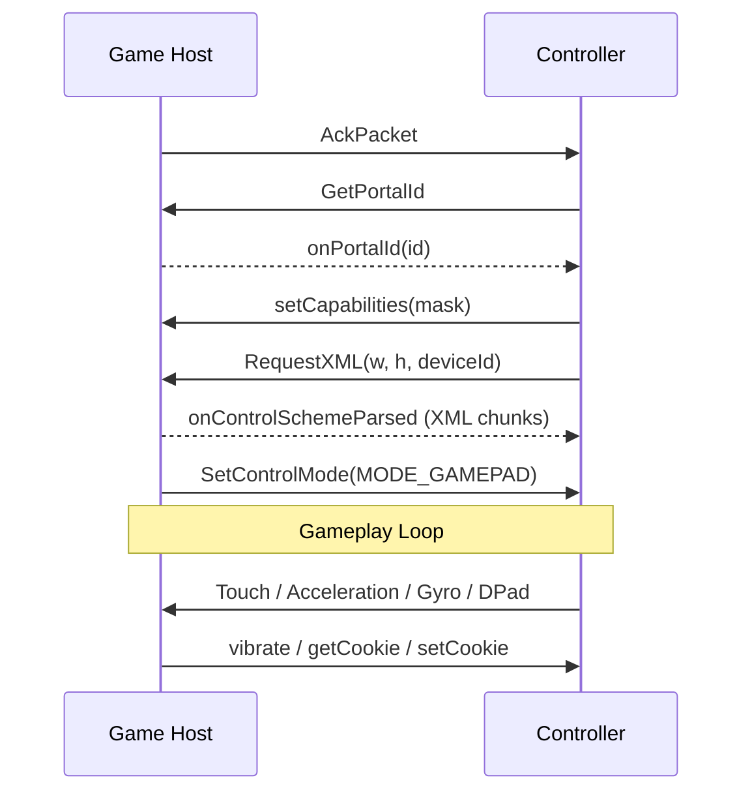

# Game Session RPC

Once a controller and game host establish a direct connection (via [`registry.relay`](../registry/relay.md)), they communicate using RPC methods sent over the direct TCP link.

These methods manage the gameplay session: delivering control layouts, configuring sensors, handling virtual buttons, cookies, and trial/purchase flows.

## Session Flow

## RPC Methods

### Host to Controller

| Method | Description |
|--------|-------------|
| [`SetControlMode`](set-control-mode.md) | Switch the controller to a specific input mode. |
| [`enableAccelerometer`](sensor-config.md) | Enable/disable accelerometer, optionally set sample interval. |
| [`setTouchInterval`](sensor-config.md) | Set the touch input sample interval. |
| [`enableTouch`](sensor-config.md) | Enable or disable touch input. |
| [`enableGyro`](sensor-config.md) | Enable or disable gyroscope input. |
| [`setGyroInterval`](sensor-config.md) | Set the gyroscope sample interval. |
| [`enableOrientation`](sensor-config.md) | Enable or disable orientation input. |
| [`setOrientationInterval`](sensor-config.md) | Set the orientation sample interval. |
| [`setReliabilityForTouch`](reliability-config.md) | Set touch/sensor reliability. |
| [`getCookie`](cookies.md) | Request a persistent value from the controller's storage. |
| [`setCookie`](cookies.md) | Write a persistent value to the controller's storage. |
| [`vibrate`](vibrate.md) | Trigger the controller's vibration motor. |
| [`promptTrialUpsell`](trial-purchase.md) | Prompt the controller to show the trial upsell UI. |
| [`updateWallet`](trial-purchase.md) | Tell the controller to refresh its in-app currency wallet. |
| [`WaitForNewHost`](trial-purchase.md) | Instruct the controller to wait for a new host connection. |

### Controller to Host

| Method | Description |
|--------|-------------|
| [`GetPortalId`](portal-id.md) | Request the host's portal identifier. |
| [`setCapabilities`](capabilities.md) | Report the controller's hardware capabilities as a bitmask. |
| [`RequestXML`](request-xml.md) | Request the control layout schema for the controller's screen dimensions. |
| [`onNavigationString`](navigation-keyboard.md) | Deliver a system navigation event (e.g., back button). |
| [`onKeyString`](navigation-keyboard.md) | Deliver a hardware keyboard key press. |
| [`startTrial`](trial-purchase.md) | Signal the start of a trial session. |
| [`endTrial`](trial-purchase.md) | Signal the end of a trial session. |

## Notes

- All session RPCs use the [`BMInvoke`](../objects/bm-invoke.md) object format on channel 3 (Message).
- Unlike registry traffic, session RPC occurs directly between peers. The registry server is not involved during gameplay.
- The control scheme XML is delivered via [`BMByteChunk`](../objects/bm-byte-chunk.md) chunked transfer. See [RequestXML & Delivery](request-xml.md).
